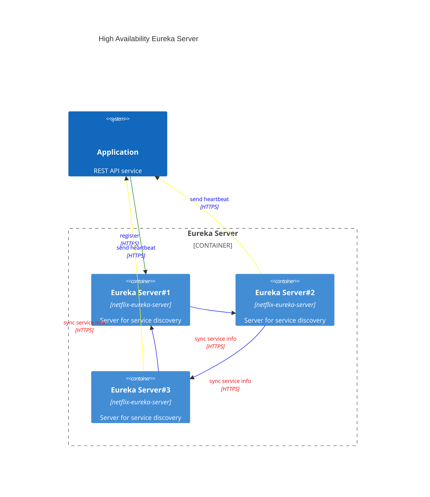

# Question & Answer

# Eureka Server start `TransportException: Cannot execute request on any known server`
Eureka client can't connect to Eureka Server.  
You could
1. update eureka server port to 8761 as the default one. You might be assigned to 8080 due to our project is a Spring Web project based on Tomcat
2. disable Eureka server to register himself as a client by `eureka.client.register-with-eureka=false`
```java
// From @EnableEurekaServer source code, we can see it will let your app act as a server & client
// Since it acts as a client, it needs to send heartbeat signal to register server 
@Target(ElementType.TYPE)
@Retention(RetentionPolicy.RUNTIME)
@Documented
@Import(EurekaServerMarkerConfiguration.class)
public @interface EnableEurekaServer {

}
```

# Eureka server high availability
To create several Eureka servers and register them as a chain.  
Eureka client should register him self to all Eureka servers.


# Client side discovery VS Server side discovery
- Client side discovery doesn't require proxy, it ask for a list of usable target server IP from service register center and implement a load-balance algorithm by himself
- Server side discovery requires a proxy, proxy will handle input request and dispatch to one instance

| Architecture          | Provider       |
|-----------------------|----------------|
| Client side discovery | Eureka         |
| Server side discovery | Nginx, ZK, K8S |

# About service URL choosing, how is @LoadBalanced working?
Annotation `@LoadBalanced` is used to indicate an instance of `RestTemplate` should use Spring Load Balance Client.  
During spring context initialization, framework will add an interceptor into it, `org.springframework.cloud.client.loadbalancer.LoadBalancerInterceptor`.  
That interceptor is using `org.springframework.cloud.client.loadbalancer.LoadBalancerClient` to communicate with Eureka Server and choose service host by given service ID.

# Difference between bootstrap file and application file?
[priority of bootstrap and application file](https://zhuanlan.zhihu.com/p/610976436)  
bootstrap file is used to load external resource before setup application context, 
it is loaded before application file.  
Something like configuration in config-server will be configured in bootstrap, to load essential configuration like DCP parameters.  
Then, spring starts to init application context to build DCP

# Difference between application.properties and application-{{suffix}}.properties
First of all, suffix usually means environment.  
Then, while application context initialization, Spring will read both application.properties and application-{{currentEnv}}.properties, merge them together.  
Last, the usage of application.properties is to store common configuration for all env. Same for YML.

# How to config Spring Cloud Bus for config-server and config-client?
Spring cloud bus is used to provide auto-refresh mechanism for config-client.  
1. config change in github
2. webhook to notice config server
3. config server send message via MQ (RabbitMQ, Kafka, Spring AMQP, Redis)
4. config client receive message & update its config without restart  

See [Spring Cloud Bus](https://www.baeldung.com/spring-cloud-bus)

# How to trigger config-server refresh from github webhook?
URL is: `POST http://{{CONFIG SERVER HOST}}/monitor`  
```
# request header
X-Github-Event:push
# request body
path=*
```
refer to [Push Notifications and Spring Cloud Bus](https://cloud.spring.io/spring-cloud-config/multi/multi__push_notifications_and_spring_cloud_bus.html)

# How to confirm configuration is refreshed in config-client?
1. from log, you can see `org.springframework.cloud.bus.event.RefreshListener: Key refreshed: [XXXX]`, all the keys in array are refreshed
2. use `/actuator/env` to load all environment properties, then check

# How to enable auto refresh upon spring bean?
To add annotation `@RefreshScope` upon it

# How `@RefreshScope` works?
1. once refresh is needed, spring refresh listener will create a `org.springframework.cloud.context.scope.refresh.RefreshScopeRefreshedEvent`
2. the event default name is `refresh all`, it could contain special bean name
3. the listener is `org.springframework.cloud.context.scope.refresh.RefreshScope`
4. if it is `refresh all`, it will destroy all beans annotated with `@RefreshScope` and register a new one with same bean name in context
5. if it is `refresh(name)`, it just destroy that bean
6. afterward, any component which use the bean will get a new instance from context with the latest properties

# How to use Spring Cloud Stream with RabbitMQ?
Spring Cloud Stream can bind two kinds of message middleware:
1. RabbitMQ
2. Kafka

It provides an abstract layer upon message middleware and make message produce/consume/error handling more configurable. We can focus on business logic.  
Since SpringCloud 3.1.X, it supports functional programming.

__Reference__  
- [Spring Cloud Stream](https://docs.spring.io/spring-cloud-stream/docs/3.2.7/reference/html/spring-cloud-stream.html#spring-cloud-stream-reference)
- [Bind](https://docs.spring.io/spring-cloud-stream/docs/3.2.7/reference/html/spring-cloud-stream.html#_bindings)
- [Test](https://docs.spring.io/spring-cloud-stream/docs/3.2.7/reference/html/spring-cloud-stream.html#_testing)
- [Send message based on external data](https://docs.spring.io/spring-cloud-stream/docs/3.2.7/reference/html/spring-cloud-stream.html#_fat_jar)
- [About non-functional programming](https://www.baeldung.com/spring-cloud-stream)