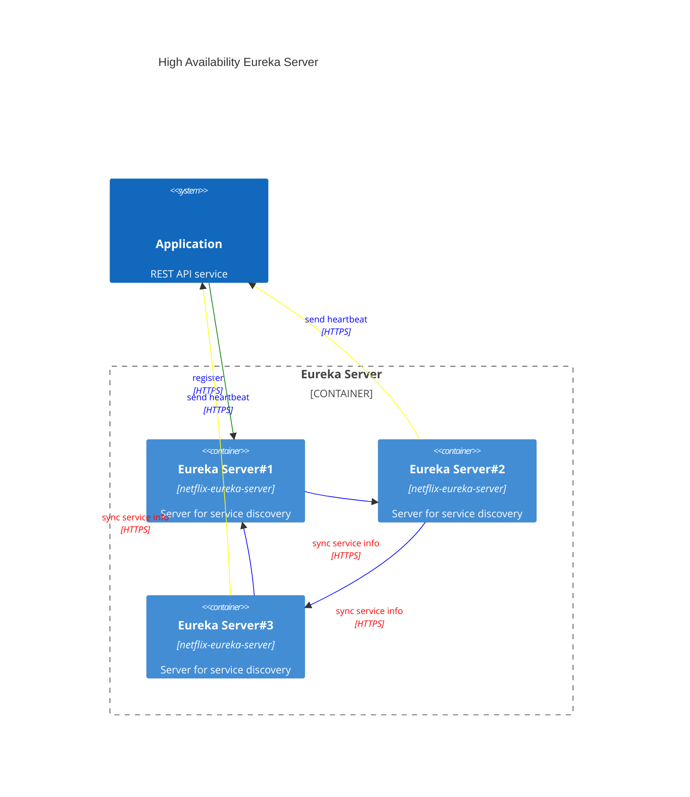

# Question & Answer

# Eureka Server start `TransportException: Cannot execute request on any known server`
Eureka client can't connect to Eureka Server.  
You could
1. update eureka server port to 8761 as the default one. You might be assigned to 8080 due to our project is a Spring Web project based on Tomcat
2. disable Eureka server to register himself as a client by `eureka.client.register-with-eureka=false`
```java
// From @EnableEurekaServer source code, we can see it will let your app act as a server & client
// Since it acts as a client, it needs to send heartbeat signal to register server 
@Target(ElementType.TYPE)
@Retention(RetentionPolicy.RUNTIME)
@Documented
@Import(EurekaServerMarkerConfiguration.class)
public @interface EnableEurekaServer {

}
```

# Eureka server high availability
To create several Eureka servers and register them as a chain.  
Eureka client should register him self to all Eureka servers.


# Client side discovery VS Server side discovery
- Client side discovery doesn't require proxy, it ask for a list of usable target server IP from service register center and implement a load-balance algorithm by himself
- Server side discovery requires a proxy, proxy will handle input request and dispatch to one instance

| Architecture          | Provider       |
|-----------------------|----------------|
| Client side discovery | Eureka         |
| Server side discovery | Nginx, ZK, K8S |

# About service URL choosing, how is @LoadBalanced working?
Annotation `@LoadBalanced` is used to indicate an instance of `RestTemplate` should use Spring Load Balance Client.  
During spring context initialization, framework will add an interceptor into it, `org.springframework.cloud.client.loadbalancer.LoadBalancerInterceptor`.  
That interceptor is using `org.springframework.cloud.client.loadbalancer.LoadBalancerClient` to communicate with Eureka Server and choose service host by given service ID.